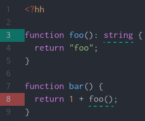

title: HHVM - faster, better, stronger. Maybe.
author: Martino Visintin
output: presentation.html
controls: false

--

# HHVM: faster, better, stronger
## (Maybe `:P`)

--
# What is it?

- Drop-in replacement for PHP5
- Developed at Facebook to move their code-base forwards
- Supports PHP and Hack languages

--
# How does it work?
PHP/Hack `==>` intermediate bytecode `=(runtime)=>` machine code

--
# Why might we care?

- Static analysis tools
- Refactor/maintain legacy PHP code? [1]
- Bonus: higher performance/lower resource usage

--
# Who uses it?

- Facebook
- Wikipedia
- Etsy
- Baidu
- [more...](https://github.com/facebook/hhvm/wiki/Users)

--
# Hack Language

- superset of PHP
- opt-in static typing (w/ type inference)
- other goodies (map/filter/reduce, enums, nullable types, immutable collections, ...)

--

--

# Caveats

- no IntelliJ support for Hack yet
  - but initial support in phpstorm by Q1 2015 [2]
- may have trouble with some PHP extensions

--
# Resources

- [HHVM.com](http://hhvm.com/)
- [1]: [The Grumpy Little Book of Hack](https://leanpub.com/grumpy-hack)
- [2]: [JetBrains Hack support](https://youtrack.jetbrains.com/issue/WI-21737)
- [How we made editing Wikipedia twice as fast](https://blog.wikimedia.org/2014/12/29/how-we-made-editing-wikipedia-twice-as-fast/)
- [Experimenting with HHVM at Etsy](https://codeascraft.com/2015/04/06/experimenting-with-hhvm-at-etsy/)
- [Engine Yard: building a better PHP](https://blog.engineyard.com/2014/hhvm-hack)
- [Learn Hack in Y minutes](http://learnxinyminutes.com/docs/hack/)
